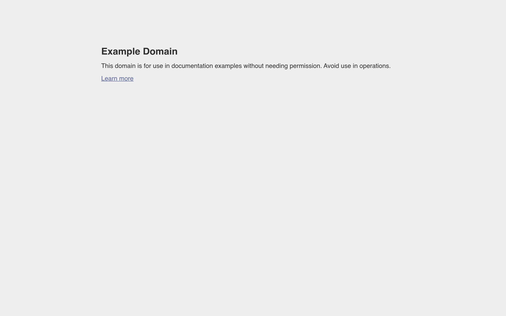

# example_design Design System

You are building UI for **example_design**. Light-themed, neutral palette, sans-serif typography (sans-serif), compact density on a 4px grid, flat elevation (no shadows).

## Visual Reference

**IMPORTANT**: Study ALL screenshots below before writing any UI. Match colors, typography, spacing, layout, and motion exactly as shown.

### Homepage



> Read `references/DESIGN.md` for full token details.

## Design Philosophy

- **Solid colors only** — no gradients anywhere. Every surface is a single flat color.
- **Single typeface** — sans-serif carries all text. Hierarchy comes from size, weight, and color — never font mixing.
- **compact density** — 4px base grid. Every dimension is a multiple of 4.
- **neutral palette** — the color temperature runs neutral, matching the sans-serif typography.
- **Minimal motion** — prefer instant state changes. Only use transitions for loading and page transitions.

## Color System

### Core Palette

| Role | Token | Hex | Use |
|------|-------|-----|-----|
| Background | `--background` | `#eeeeee` | Page/app background |

### Extended Palette

- `#334488`

## Typography

### Font Stack

- **sans-serif** — Heading 1, Heading 2, Heading 3, Body, Caption

### Type Scale

| Role | Family | Size | Weight |
|------|--------|------|--------|
| Heading 1 | sans-serif | 48px / 3rem | 700 |
| Heading 2 | sans-serif | 32px / 2rem | 600 |
| Heading 3 | sans-serif | 24px / 1.5rem | 600 |
| Body | sans-serif | 16px / 1rem | 400 |
| Caption | sans-serif | 12px / 0.75rem | 400 |

### Typography Rules

- All text uses **sans-serif** — never add another font family
- Max 3-4 font sizes per screen
- Headings: weight 600-700, body: weight 400
- Use color and opacity for text hierarchy, not additional font sizes
- Line height: 1.5 for body, 1.2 for headings

## Spacing & Layout

### Base Grid: 4px

Every dimension (margin, padding, gap, width, height) must be a multiple of **4px**.

### Spacing Scale

`4, 8, 12, 16, 20, 24, 32, 40, 48, 64` px

### Spacing as Meaning

| Spacing | Use |
|---------|-----|
| 4-8px | Tight: related items (icon + label, avatar + name) |
| 12-16px | Medium: between groups within a section |
| 24-32px | Wide: between distinct sections |
| 48px+ | Vast: major page section breaks |

### Border Radius

Scale: `8px`
Default: `8px`

## Component Patterns

### Card

```css
.card {
  background: #eeeeee;
  border-radius: 8px;
  padding: 16px;
}
```

```html
<div class="card">
  <h3>Card Title</h3>
  <p>Card content goes here.</p>
</div>
```

### Button

```css
/* Primary */
.btn-primary {
  background: #cccccc;
  color: #cccccc;
  border-radius: 8px;
  padding: 8px 16px;
  font-weight: 500;
  transition: opacity 150ms ease;
}
.btn-primary:hover { opacity: 0.9; }

/* Ghost */
.btn-ghost {
  background: transparent;
  border: 1px solid #cccccc;
  color: #cccccc;
  border-radius: 8px;
  padding: 8px 16px;
}
```

```html
<button class="btn-primary">Get Started</button>
<button class="btn-ghost">Learn More</button>
```

### Input

```css
.input {
  background: #eeeeee;
  border: 1px solid #cccccc;
  border-radius: 8px;
  padding: 8px 12px;
  color: #cccccc;
  font-size: 14px;
}
.input:focus { border-color: var(--accent); outline: none; }
```

```html
<input class="input" type="text" placeholder="Search..." />
```

### Badge / Chip

```css
.badge {
  display: inline-flex;
  align-items: center;
  padding: 4px 8px;
  border-radius: 9999px;
  font-size: 12px;
  font-weight: 500;
  background: #eeeeee;
  color: #6b7280;
}
```

```html
<span class="badge">New</span>
<span class="badge">Beta</span>
```

### Modal / Dialog

```css
.modal-backdrop { background: rgba(0, 0, 0, 0.6); }
.modal {
  background: #eeeeee;
  border-radius: 8px;
  padding: 24px;
  max-width: 480px;
  width: 90vw;
}
```

```html
<div class="modal-backdrop">
  <div class="modal">
    <h2>Dialog Title</h2>
    <p>Dialog content.</p>
    <button class="btn-primary">Confirm</button>
    <button class="btn-ghost">Cancel</button>
  </div>
</div>
```

### Table

```css
.table { width: 100%; border-collapse: collapse; }
.table th {
  text-align: left;
  padding: 8px 12px;
  font-weight: 500;
  font-size: 12px;
  color: #6b7280;
  text-transform: uppercase;
  letter-spacing: 0.05em;
  border-bottom: 1px solid #cccccc;
}
.table td {
  padding: 12px;
  border-bottom: 1px solid #cccccc;
}
```

```html
<table class="table">
  <thead><tr><th>Name</th><th>Status</th><th>Date</th></tr></thead>
  <tbody>
    <tr><td>Item One</td><td>Active</td><td>Jan 1</td></tr>
    <tr><td>Item Two</td><td>Pending</td><td>Jan 2</td></tr>
  </tbody>
</table>
```

### Navigation

```css
.nav {
  display: flex;
  align-items: center;
  gap: 8px;
  padding: 12px 16px;
}
.nav-link {
  color: #6b7280;
  padding: 8px 12px;
  border-radius: 8px;
  transition: color 150ms;
}
```

```html
<nav class="nav">
  <a href="/" class="nav-link active">Home</a>
  <a href="/about" class="nav-link">About</a>
  <a href="/pricing" class="nav-link">Pricing</a>
  <button class="btn-primary" style="margin-left: auto">Get Started</button>
</nav>
```

## Page Structure

The following page sections were detected:

- **Hero** — Hero section (detected from heading structure)

When building pages, follow this section order and structure.

## Animation & Motion

This project uses **subtle motion**. Transitions smooth state changes without calling attention.

### Motion Guidelines

- **Duration:** 150-300ms for micro-interactions, 300-500ms for page transitions
- **Easing:** `ease-out` for enters, `ease-in` for exits
- **Direction:** Elements enter from bottom/right, exit to top/left
- **Reduced motion:** Always respect `prefers-reduced-motion` — disable animations when set

## Depth & Elevation

This design uses **flat elevation** — no box-shadows anywhere.

### Elevation Strategy

| Level | Technique | Use |
|-------|-----------|-----|
| 0 — Base | Background color | Page background |
| 1 — Raised | Lighter surface + subtle border | Cards, panels |
| 2 — Floating | Even lighter surface + stronger border | Dropdowns, popovers |
| 3 — Overlay | Backdrop + modal surface | Modals, dialogs |

## Anti-Patterns (Never Do)

- **No box-shadow** on any element — use borders and surface colors for depth
- **No gradients** — solid colors only, everywhere
- **No blur effects** — no backdrop-blur, no filter: blur()
- **No zebra striping** — tables and lists use borders for separation
- **No invented colors** — every hex value must come from the palette above
- **No arbitrary spacing** — every dimension is a multiple of 4px
- **No extra fonts** — only sans-serif are allowed
- **No arbitrary border-radius** — use the scale: 8px
- **No opacity for disabled states** — use muted colors instead
- **No pill shapes** — this design doesn't use rounded-full / 9999px radius

## Workflow

1. **Read** `references/DESIGN.md` before writing any UI code
2. **Pick colors** from the Color System section — never invent new ones
3. **Set typography** — sans-serif only, using the type scale
4. **Build layout** on the 4px grid — check every margin, padding, gap
5. **Match components** to patterns above before creating new ones
6. **Apply elevation** — flat, surface color shifts only
7. **Validate** — every value traces back to a design token. No magic numbers.

## Brand Spec

- **Favicon:** `/favicon.ico`
- **Site URL:** `https://example.com`
- **Brand typeface:** sans-serif

## Quick Reference

```
Background:     #eeeeee
Surface:        (not extracted)
Text:           (not extracted) / (not extracted)
Accent:         (not extracted)
Border:         (not extracted)
Font:           sans-serif
Spacing:        4px grid
Radius:         8px
Components:     0 detected
```

## When to Trigger

Activate this skill when:
- Creating new components, pages, or visual elements for example_design
- Writing CSS, Tailwind classes, styled-components, or inline styles
- Building page layouts, templates, or responsive designs
- Reviewing UI code for design consistency
- The user mentions "example_design" design, style, UI, or theme
- Generating mockups, wireframes, or visual prototypes

---

# Full Reference Files

> Every output file is embedded below. Claude has full design system context from /skills alone.

## Design System Tokens (DESIGN.md)

# example_design DESIGN.md

> Auto-generated design system — reverse-engineered via static analysis by skillui.
> Frameworks: None detected
> Colors: 2 · Fonts: 1 · Components: 0
> Icon library: not detected · State: not detected
> Primary theme: light · Dark mode toggle: no · Motion: none

## Visual Reference

**Match this design exactly** — study colors, fonts, spacing, and component shapes before writing any UI code.


---

## 1. Visual Theme & Atmosphere

This is a **light-themed** interface with a neutral, approachable feel. The light background emphasizes content clarity. Typography uses **sans-serif** throughout — a clean, modern choice that maintains consistency. Spacing follows a **4px base grid** (compact density), with scale: 4, 8, 12, 16, 20, 24, 32, 40px.

---

## 2. Color Palette & Roles

| Token | Hex | Role | Use |
|---|---|---|---|
| background | `#eeeeee` | background | Page background, darkest surface |
| info | `#334488` | info | Informational highlights |


---

## 3. Typography Rules

**Font Stack:**
- **sans-serif** — Heading 1, Heading 2, Heading 3, Body, Caption

| Role | Font | Size | Weight |
|---|---|---|---|
| Heading 1 | sans-serif | 48px / 3rem | 700 |
| Heading 2 | sans-serif | 32px / 2rem | 600 |
| Heading 3 | sans-serif | 24px / 1.5rem | 600 |
| Body | sans-serif | 16px / 1rem | 400 |
| Caption | sans-serif | 12px / 0.75rem | 400 |

**Typographic Rules:**
- Use **sans-serif** for all text — do not mix font families
- Maintain consistent hierarchy: no more than 3-4 font sizes per screen
- Headings use bold (600-700), body uses regular (400)
- Line height: 1.5 for body text, 1.2 for headings
- Use color and opacity for secondary hierarchy, not additional font sizes


---

## 4. Component Stylings

No components detected. Scan `src/components/` or `components/` to populate this section.

---

## 5. Layout Principles

- **Base spacing unit:** 4px
- **Spacing scale:** 4, 8, 12, 16, 20, 24, 32, 40, 48, 64
- **Border radius:** 8px

**Spacing as Meaning:**
| Spacing | Use |
|---|---|
| 4-8px | Tight: related items within a group |
| 12-16px | Medium: between groups |
| 24-32px | Wide: between sections |
| 48px+ | Vast: major section breaks |


---

## 6. Depth & Elevation

No box-shadow values detected. The design appears to use a flat visual style.


---

## 8. Do's and Don'ts

### Do's

- Use `#eeeeee` as the primary page background
- Use **sans-serif** for all UI text
- Follow the **4px** spacing grid for all margins, padding, and gaps
- Use border and background shifts for elevation — not shadows
- Use border-radius from the scale: 8px

### Don'ts

- Don't introduce colors outside this palette — extend the design tokens first
- Don't mix font families — use sans-serif consistently
- Don't use arbitrary spacing values — stick to multiples of 4px
- Don't add box-shadow — this design system uses flat elevation
- Don't use gradients — the design uses solid colors only
- Don't use arbitrary border-radius values — pick from the defined scale
- Don't use backdrop-blur or blur effects

### Anti-Patterns (detected from codebase)

- No box-shadow on any element
- No gradient backgrounds
- No blur or backdrop-blur effects
- No zebra striping on tables/lists


---

## 9. Responsive Behavior

No breakpoints detected. Consider adding responsive breakpoints to the design system.

---

## 10. Agent Prompt Guide

Use these as starting points when building new UI:

### Build a Card

```
Background: #eeeeee
Border: 1px solid var(--border)
Radius: 8px
Padding: 16px
Font: sans-serif
No shadows — use borders and surface colors for depth.
```

### Build a Button

```
Primary: bg var(--accent), text white
Ghost: bg transparent, border var(--border)
Padding: 8px 16px
Radius: 8px
Hover: opacity 0.9 or lighter shade
Focus: ring with var(--accent)
```

### Build a Page Layout

```
Background: #eeeeee
Max-width: 1280px, centered
Grid: 4px base
Responsive: mobile-first, breakpoints from Section 9
```

### Build a Stats Card

```
Surface: #eeeeee
Label: var(--text-muted) (muted, 12px, uppercase)
Value: var(--text-primary) (primary, 24-32px, bold)
Status: use success/warning/danger from Section 2
```

### Build a Form

```
Input bg: #eeeeee
Input border: 1px solid var(--border)
Focus: border-color var(--accent)
Label: var(--text-muted) 12px
Spacing: 16px between fields
Radius: 8px
```

### General Component

```
1. Read DESIGN.md Sections 2-6 for tokens
2. Colors: only from palette
3. Font: sans-serif, type scale from Section 3
4. Spacing: 4px grid
5. Components: match patterns from Section 4
6. Elevation: flat, surface shifts
```

## Homepage Screenshots (screenshots/)


