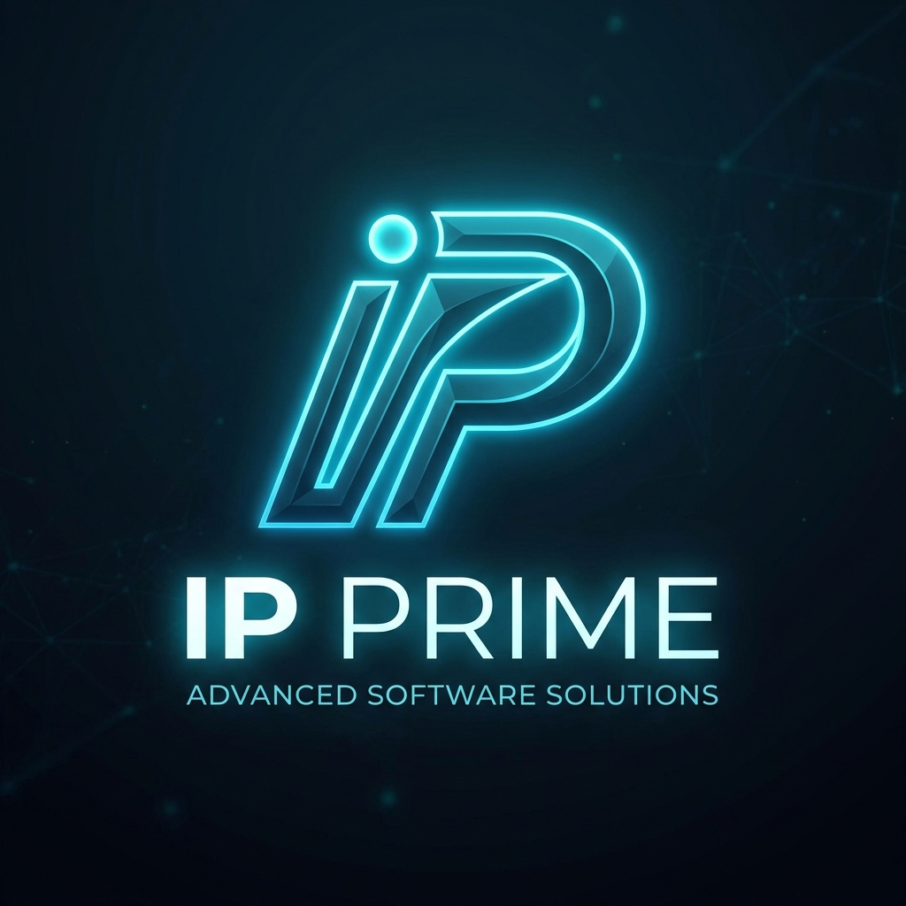

<div align="center">
 


# 🤖 IP Prime OS
### *Intelligent Partner Prime OS Shell*

**The Ultimate AI-Powered Desktop OS Shell & Personal Assistant**
*Custom-built for Pratik Thorat*

<br>

[](https://python.org)
[](https://deepmind.google/technologies/gemini/)
[](https://github.com)
[](https://github.com)

<br>

> *"Not just an assistant — a complete AI-driven Operating System desktop shell environment."*

</div>

---

## 🌟 What is IP Prime OS?

**IP Prime OS** is a real-time, voice-driven **AI Desktop Operating System Shell** and agentic workspace that can **hear**, **see**, **think**, and **act** — all running directly on top of your local system. No subscriptions. No cloud lock-in. Pure autonomy.

Built on Google's **Gemini AI**, IP Prime OS bridges the gap between human intent and native OS execution. It replaces or overlays standard desktop environments with a beautiful glassmorphic shell, featuring custom taskbars, interactive WiFi/Bluetooth trays, a system Control Center flyout, an always-on log terminal, gesture controls, and a background cleaner daemon. It speaks with you, watches your screen, controls your computer, writes code, manages files, and hosts an elite team of **12 specialized autonomous AI agents** (the IP Army).

Engineered from the ground up by **Pratik Thorat** as a personal powerhouse digital cockpit.

---

## 🚀 Feature Overview

### 🎙️ Voice & Conversation
| Feature | Details |
|---|---|
| Real-time Voice Input | Ultra-low latency mic capture via `sounddevice` |
| Natural Language Understanding | Full conversational context via Gemini AI |
| Dynamic Welcome Greetings | Custom AI-generated audio greetings on every launch |
| Hybrid Input Mode | Seamlessly switch between voice and keyboard |
| Multi-language Support | Understands and responds in any language |

### 🖥️ System Control
| Feature | Details |
|---|---|
| App Launcher | Open any app by name on any OS |
| File Controller | Create, move, rename, delete, zip files & folders |
| Computer Settings | Adjust volume, brightness, Wi-Fi, Bluetooth, themes |
| Audio Mixer | App-level volume control via `pycaw` |
| Terminal Execution | Run shell commands, scripts, and programs |
| Desktop Control | Interact with any open window or the desktop |

### 🧠 AI & Intelligence
| Feature | Details |
|---|---|
| **🧠 Unlimited Memory Brain** | **8-layer unified memory — never forgets anything, ever** |
| Smart AI Routing | Routes coding requests to NVIDIA NIM & general to Gemini |
| Screen Vision | Analyze and describe what's on your screen in real-time |
| Webcam Vision | See the world through your camera |
| File Processor | Analyze PDFs, images, source code, and documents |
| Semantic Memory | Persistent memory of your projects and preferences |
| SQLite Knowledge Graph | Entities, facts (SPO triples), relations, timeline events |
| Vector Store (LanceDB) | Semantic embeddings for every conversation & document |
| Archive Compression | Weekly/monthly digests of past conversations |
| Semantic Router | Intelligently routes intent to the right action module |
| Agent Orchestrator | Autonomous multi-step task planning and execution |
| OpenRouter Fallback | Resilient cascade fallback to OpenRouter Free LLMs on Gemini/Nvidia 429 rate limit errors |
| Screen Crash Auditor | Context-aware proactive screen monitor targeting developer windows (3-min) & general windows (60-min) |

### 🛡️ Security & Hacking
| Feature | Details |
|---|---|
| Hacker Mode | Red skull UI badge with ethical hacking persona |
| Cybersecurity Tutor | Quizzes, learning roadmaps (CEH, OSCP), progress tracking |
| CTF Helper | Base64/Hex decoders, hash identifier, stego checks |
| Password Toolkit | Generator, strength checker, and Pwned password check |
| Encryption Tools | AES encrypt/decrypt and secure key generation |

### 🌐 Web & Research
| Feature | Details |
|---|---|
| Browser Control | Full Playwright-powered browser automation (Camoufox) |
| Web HUD | Floating web interface overlay on your desktop |
| Web Search | DuckDuckGo-powered instant search |
| Flight Finder | Search and compare flights directly |
| Weather Report | Real-time weather with silent wttr.in fallback, avoiding browser popups unless requested |
| YouTube Helper | Fetch transcripts, search, and summarize videos |

### 💬 Communication
| Feature | Details |
|---|---|
| WhatsApp Listener | Read and send WhatsApp messages |
| Send Message | Cross-platform messaging integration |
| Broadcast Center | Broadcast notifications and updates |
| Smart Home | Control smart home devices |
| Mobile Telekinesis | Control and mirror your mobile device |

### 💻 Developer Tools
| Feature | Details |
|---|---|
| Dev Agent | Autonomous coding agent with Git integration |
| Code Helper | AI code review, refactor, explain, and generate |
| Ghost Coder | Stealth background code generation |
| GitHub Assistant | Manage repos, commits, PRs, and issues |
| Aider Helper | Aider AI coding assistant integration |
| MCP Client | Model Context Protocol tool integration |
| Pascal 3D Designer | 3D design and visualization assistant |
| Design Extractor | Extract UI designs from screenshots |
| Warp Helper | Warp terminal integration |
| Prime Auditor | Internal security & code quality audit system |

### 📅 Productivity
| Feature | Details |
|---|---|
| Calendar Helper | Manage events and schedules |
| Reminder System | Smart reminders and alarms |
| Chronos Routines | Scheduled & recurring task automation |
| Obsidian Helper | Integrate with Obsidian knowledge base |
| Obsidian Auto-Organizer | Semantic note auto-organizer, linker, and daily/weekly productivity summaries |
| Spotify Helper | Control Spotify playback |
| Media Controller | System-wide media controls |
| n8n Dispatcher | Trigger n8n automation workflows |

### 🎮 Gaming & Entertainment
| Feature | Details |
|---|---|
| Game Updater | Manage and update PC games |
| Awesome Repos Helper | Discover and clone GitHub awesome lists |
| Prime Watcher | Watch and monitor processes and windows |

### 🖼️ UI & Interface
| Feature | Details |
|---|---|
| Glassmorphic HUD | Beautiful translucent floating window |
| Adaptive Layouts | Fully resizable and responsive interface |
| Transparency Controls | Adjustable opacity and blur effects |
| Smart Drop Zone | Drag-and-drop file upload into the assistant |
| Dashboard | Integrated HTML web dashboard |
| GUI Window Switcher | Switch to any running window's GUI view |
| Desktop Preview | Live desktop preview in assistant |
| **🎛️ Control Center Flyout** | **Premium panel containing volume and brightness sliders, DND toggle, and system quick actions** |
| **📟 Vocal Terminal HUD** | **Glassmorphic floating terminal console streaming live logger output directly in the workspace** |
| **🔮 Dynamic Multi-Wave Orb** | **Redesigned orb waves with 4 phase-shifted sine layers and dynamic floating particles** |
| **🌌 Aurora Wallpaper** | **Animated layered radial gradient background shifting dynamically in real-time** |
| **⌨️ Global OS Hotkeys** | **Quick overlays toggling via Keyboard shortcuts: Ctrl+Shift+P/L/T/C and F1** |

### 👥 The IP AI Army
IP Prime coordinates an elite team of **12 specialized autonomous agents** (the IP Army) to execute system-level operations, research, coding, and debugging tasks:
*   **IP Prime (Grand Coordinator & Command Center)** - Ecosystem orchestration, database integration, and state manager.
*   **Claude (Reasoning & Research Specialist)** - Deep logical analysis, code refactoring strategies, and system design structures.
*   **Hermes (Automation & Operations Commander)** - Routine execution, background automation, and Windows Task Scheduler integration.
*   **AntiGravity (Runtime Orchestration & Stability Engine)** - System performance monitor, thread pool optimizer, and screen/clipboard tracking loops.
*   **Obsidian (Security Sentinel)** - Security auditing, encryption validation, and data compliance tracking.
*   **Agent Inferno (Lead Tactician / Developer)** - Rapid code writing, test loops, compiler error debugging, and syntax stability.
*   **Agent Zenith (Lead Architect / Auditor)** - System dependency checks, configurations auditing, and SOLID patterns compliance.
*   **IP Scout (Research Division)** - Competitor analysis, facts gathering, and internet summaries.
*   **IP Scribe (Content & Copywriting Division)** - Markdown formatting, copywriting, blog drafting, and email compositions.
*   **IP Codex (Code Generation Division)** - Direct script writing and HTML/CSS web layout builds.
*   **IP Lexicon (Translation & Localization Division)** - Preserving tone and formatting across multi-lingual translations.
*   **IP Audit (Quality Assurance Division)** - Syntax checking, code reviews, and accessibility standards.

---

## ⚡ Quick Start

```bash
# 1. Clone the repository
git clone https://github.com/thoratpratik2323-hue/ip-prime.git
cd ip-prime

# 2. Run setup (installs dependencies automatically)
python setup.py

# 3. Launch IP Prime
python main.py
```

> **⚠️ Note:** Some OS-specific packages are not in `requirements.txt` to keep the repo lightweight.
> If you hit a `ModuleNotFoundError`, just run:
> ```bash
> pip install <module_name>
> ```

---

## 📋 Requirements

| Requirement | Details |
|---|---|
| **OS** | Windows 10/11 *(primary)*, macOS, Linux |
| **Python** | 3.11 or 3.12 |
| **Microphone** | Required for voice interaction |
| **API Key** | Google Gemini API key (free tier works) |
| **RAM** | 8 GB minimum recommended |

### Key Dependencies

```
google-genai          # Gemini AI SDK
sounddevice           # Real-time audio capture
pyqt6                 # Desktop UI framework
playwright / camoufox # Browser automation
pyautogui             # Mouse & keyboard control
mss + opencv-python   # Screen capture & vision
pycaw                 # Windows audio mixer
pywinauto             # Windows GUI automation
pygetwindow           # Window management
psutil                # Process monitoring
beautifulsoup4        # Web scraping
duckduckgo-search     # Web search
youtube-transcript-api # YouTube integration
python-pptx           # PowerPoint generation
send2trash            # Safe file deletion
```

> **Optional:** `pip install mediapipe` — enables hand gesture control

---

## 🏗️ Project Structure

```
ip-prime/
├── main.py                  # 🚀 Entry point & AI core engine
├── ui_core.py               # 🖼️ Full UI layer (PyQt6 glassmorphic HUD)
├── ui.py                    # UI launcher
├── setup.py                 # Auto-installer
├── requirements.txt         # Python dependencies
│
├── actions/                 # 🎯 All feature modules (48 files)
│   ├── agent_orchestrator.py    # Multi-agent task planning
│   ├── browser_control.py       # Playwright browser automation
│   ├── code_helper.py           # AI code assistant
│   ├── computer_control.py      # Mouse, keyboard, screen control
│   ├── computer_settings.py     # OS settings control
│   ├── dev_agent.py             # Autonomous developer agent
│   ├── file_controller.py       # File system operations
│   ├── file_processor.py        # Document & media processing
│   ├── screen_processor.py      # Screen vision & analysis
│   ├── web_hud.py               # Web overlay dashboard
│   ├── whatsapp_listener.py     # WhatsApp integration
│   └── ...                      # 36 more action modules
│
├── agent/                   # 🤖 Agent execution engine
├── core/                    # ⚙️ Core utilities
├── prime_platform/          # 🔧 Platform abstractions
├── memory/                  # 🧠 Unlimited Memory Brain
│   ├── brain.py                 # 🧠 Unified 8-layer brain orchestrator
│   ├── summarizer.py            # 📦 Archive compression engine
│   ├── memory_manager.py        # Memory persistence & extraction
│   ├── autonomous_memory.py     # Episodic memory system
│   └── archive/                 # Daily conversation JSONL logs
│
├── config/                  # ⚙️ Configuration files
├── assets/                  # 🎨 Icons, sounds, resources
├── docs/                    # 📚 Documentation
└── logs/                    # 📋 Runtime logs
```

---

## 🆕 Changelog — Latest Updates

### v9.x — *Dynamic Multi-Wave Orb, Control Center Flyout, Vocal Terminal logs HUD & Background Cleaner (Current)*
- 🔮 **Dynamic Multi-Wave Orb & Particle FX** — Completely redesigned the central energy orb to render 4 independent phase-shifted translucent waves with frequency and amplitude modulations matching assistant states (Idle vs. Listening vs. Processing), coupled with a floating particle emission field.
- 🎛️ **Premium Control Center Flyout** — Implemented a control panel overlay containing system volume sliders (powered by core-audio `pycaw`), system brightness sliders (WMI queries under `root\wmi`), DND persistence state toggling, and instant quick-launch actions (Lock PC, Screenshot, Task Manager, Fullscreen).
- 📟 **Vocal Terminal Log Console** — Created a glassmorphic floating panel on the desktop that binds directly to Saturday's system logger output via PyQt custom signals, displaying real-time system logs.
- 🧹 **Workspace Cleaner Daemon** — Built an asynchronous background scanner thread running every 60 seconds that cleans temporary garbage, redundant log logs, and empty cache directories.
- 🌌 **Aurora Wallpaper & Global Hotkeys** — Added animated radial gradient overlays dynamically shifting to resemble the aurora borealis, alongside global OS hotkeys: `Ctrl+Shift+P` (App Launcher), `Ctrl+Shift+L` (Control Center), `Ctrl+Shift+T` (Vocal Terminal), and `Ctrl+Shift+C` (Control Center panel toggle).

### v8.x — *Fluent Windows Theme, Custom Taskbar Pinning & High-Performance Rendering*
- 🎨 **Fluent Windows Dark Theme** — Redesigned the entire desktop color scheme to feature Microsoft's premium dark fluent/mica palette with translucent deep dark acrylic panels (`#10121a`), glowing border accents (`#60cdff`), and soft-gray premium typography.
- 📌 **Custom App Pinning & Unpinning** — Added right-click context menu capabilities directly inside the App Launcher. Users can right-click any scanned or custom app to instantly `"Pin to Taskbar"` or `"Unpin from Taskbar"`. Pinned configurations are persisted across sessions in `config/pinned_apps.json`.
- 🌐 **Interactive WiFi & Bluetooth Taskbar Trays** — Upgraded static tray stats into interactive launch buttons. Click the WiFi indicator to open the Windows Network/WiFi connections flyout (`ms-availablenetworks:`), and click the Bluetooth indicator to open Windows Bluetooth settings (`ms-settings:bluetooth`) to pair headphones/devices instantly.
- 🚀 **98% Plexus Rendering Optimization** — Resolved CPU thread lagging and hangs by implementing pre-calculated squared-distance checks (`dist_sq < 16900`) and pre-allocating drawing pens/brushes inside the PyQt6 paintEvent. Reduced plexus particles from 90 to 45 for an elegant, lightweight visual look.
- 📁 **Targeted Workspace Remapping** — Remapped the canonical code output and project saving workspace to **`D:\primes output`** system-wide across all configs, tools, adapters, and LLM system prompts.
- 🔮 **Enlarged AI Orb & Relocated Status Text** — Resized the central energy orb diameter from `145px` to `175px` and moved the status indicators (`PRIME OS`, `LISTENING`, `THINKING`, `SPEAKING`) to float dynamically above the sphere boundary with state-matching colors.
- 🩹 **Auto-healing Import Issues**: Added `memory/encryption.py` and `memory/semantic.py` to fix critical runtime module dependencies and imports for study mode and local indexer tools.

### v7.x — *Resilience, Proactive Audits & IP AI Army Unified Roster*
- 🛡️ **OpenRouter LLM Fallback Integration** — Added resilient API fallback routing to OpenRouter Free LLMs when Gemini or Nvidia NIM APIs hit 429 rate limits or quota errors, ensuring uninterrupted agent execution.
- 👁️ **Proactive Screen Crash Auditor** — Implemented an intelligent screen auditor that monitors active windows and logs screen time, running every 3 minutes on developer environments (VS Code, terminal, etc.) and every 60 minutes on general applications.
- 📝 **Obsidian Auto-Organizer** — Built semantic note-linking, categorization, and automatic daily/weekly productivity summaries directly integrated with Pratik's Obsidian Vault.
- 🌦️ **Weather Browser Popup Prevention** — Re-engineered `weather_report.py` to silently fetch wttr.in data in the background, avoiding browser popups unless explicitly requested with `open_browser=True`.
- 🎖️ **Unified IP AI Army Roster** — Consolidated the 12 specialized agents of the IP AI Army (including renaming Agent Red to **Agent Inferno** and Agent Purple to **Agent Zenith**) into a unified team command format (`ip_army`).

### v6.x — *Unlimited Memory Brain*
- 🧠 **Unlimited Memory Brain** — Architected an **8-layer unified memory system** that searches ALL memory layers simultaneously: Long-term JSON, Episodic memory, Procedural workflows, Knowledge Base, Archive JSONL transcripts, SQLite Knowledge Graph, Compressed Digests, and LanceDB Vector Store. IP Prime now has effectively **infinite memory**.
- 🗄️ **SQLite Knowledge Graph** (`memory/brain.py`) — New graph database with `entities`, `relations`, `facts` (subject-predicate-object triples), `timeline_events`, and `digests` tables. Thread-safe with WAL mode and mutex locks.
- 📦 **Archive Compression Engine** (`memory/summarizer.py`) — Automatically compresses old daily JSONL archives into weekly/monthly digests to prevent storage bloat while keeping everything searchable.
- 🔓 **Removed All Memory Caps** — `MEMORY_MAX_CHARS`: 100KB→10MB, `MAX_VALUE_LENGTH`: 1K→50K chars, `MAX_SESSION_TURNS`: 40→500, Episodic: 100→10K entries, Knowledge Base: 5K→100K entries.
- 🔧 **4 New Brain Tools** — `brain_search` (unified cross-layer search), `brain_stats` (full 8-layer statistics), `brain_store_fact` (SPO graph triples), `brain_store_event` (dated timeline events).
- ⚡ **Brain Startup Initialization** — Schema creation + archive compression runs automatically on every IP Prime session connect.

### v5.x — *CODING PROJECTS Workspace & Nvidia NIM Optimization*
- 📁 **Canonical CODING PROJECTS Workspace** — Remapped all default save directories, JSON configurations, system instructions, and tool descriptions in `core/tool_registry.py` to the new canonical `D:\primes output` directory. No more path mismatches or saving to old folders!
- 🧹 **UTF-8 BOM Clean & Self-Healing** — Cleaned all **24 JSON files** in the `memory/` and `config/` folders to remove UTF-8 Byte Order Marks (BOM), permanently preventing `JSONDecodeError` decodability crashes on startup.
- 🔗 **Nvidia NIM completions 404 Routing Fix** — Patched `actions/prime_utils.py` to intelligently intercept explicit `"gemini"` model queries (such as `"gemini-2.5-flash"`) and route them straight to the Gemini SDK, preventing 404 errors on Nvidia completions endpoint.
- 👁️ **Proactive Llama-3.2-Vision NIM Integration** — Updated `agent/vision_loop.py` to pass `model=None` to the unified model adapter. Proactive vision screenshot diagnostics now automatically load the user's configured Nvidia NIM vision model (`meta/llama-3.2-11b-vision-instruct`), cleanly integrating Nvidia NIM power into daily workflow!

### v4.x — *Multi-Agent & Unified Workspace Upgrades*
- 🔗 **Bidirectional Multi-Agent Integration** — Fully operationalized a custom bidirectional channel between IP Prime and Antigravity. IP Prime can now delegate complex coding and design requests dynamically via the newly implemented `ask_antigravity` tool, triggering headless execution in the Antigravity CLI and returning standard outputs seamlessly.
- 📁 **Unified Development Sandbox** — Remapped IP Prime's workspace directories and paths configuration (`paths.json` / `prime_features.json`) directly to the unified `C:\Users\thora\.gemini\antigravity\scratch\IP output` directory, ensuring both assistants write and execute code in the exact same workspace with zero path mismatches.
- 🐍 **Google GenAI SDK Migration** — Upgraded the entire IP Prime AI core (`brain/perception.py`, `brain/reasoning.py`, `agent/executor.py`, etc.) by fully replacing deprecated `google.generativeai` imports with the modern, officially supported `google.genai` SDK (`genai.Client`).
- 🛡️ **Nvidia API Key Self-Healing Fallback** — Enhanced `core/nvidia_client.py` to seamlessly fall back to using `"coding_api_key"` from `config/api_keys.json` when `NVIDIA_API_KEY` is absent from the OS environment variables, preventing agent command-runner timeouts or policy violations.

### v3.x
- 🧠 **Autonomous AI Second Brain & Habits Tracker** — Integrated a persistent, highly autonomous local Markdown-based Knowledge Vault at `c:/Users/thora/Documents/SecondBrain/` containing customized templates for persona (`SOUL.md`), profiles (`USER.md`), and memory ledgers (`MEMORY.md`).
- ⚡ **Zero-Latency Persistence Hooks** — Configured dynamic startup and shutdown hooks inside `core/session.py` and `memory/memory_manager.py` that continuously inject context and flush session highlights and turnovers into date-based daily logs (`daily/YYYY-MM-DD.md`) automatically on close.
- 📁 **Automated Downloads Classifier** — Added a background file classifier daemon that monitors Pratik's Windows `Downloads/` directory and auto-categorizes downloaded study materials (PDFs, PPTXs, docs) and scripts directly into the Second Brain folders.
- 📈 **Atomic Habits Engine** — Added a dynamic habits engine (`HABITS.md`) that auto-checks daily Coding progress on active Git workspace commits, study habits on categorized downloads, and logging tasks on clean exit—rendered live on the glassmorphic PyQt6 left HUD widget!
- 🌌 **Space-Themed HUD Overhaul** — Premium deep dark glassmorphic UI (`BG: #010510`, `PANEL: rgba(10, 18, 36, 0.72)`) featuring a stunning, customized **Sky Blue & White** palette with high-contrast tactical styling.
- 🧭 **Symmetrical Vertical Layout** — Floating Left Status log panel and Right widget stack (Live Chronometer clock + Asynchronous meteorological Weather probe querying `wttr.in` in a background thread) perfectly centered vertically (`AlignVCenter`) next to the central orb.
- 🌟 **Cyberpunk Neon Box Shadow Glows** — 60-FPS hardware-accelerated glowing 3D box shadows behind each floating card (Cyan for Status, Cobalt Blue for Clock, Royal Violet for Weather).
- 🏷️ **Tactical Glowing Capsule Badges** & Brackets — Styled system details inside monospaced tactical brackets (`[ ONLINE ]`, `[ ACTIVE ]`, `[ STANDBY ]`) and fine-bordered glowing pill badges.
- 🎙️ **Balanced State Visualizer & "PROCESSING" State** — Pulsating status badge (`L I S T E N I N G`, `S P E A K I N G`, `T H I N K I N G`, `P R O C E S S I N G`) moved from the bottom of the HUD orb to the top (`sy = cy - fw * 0.40`) for absolute visual symmetry, leaving high-fidelity rippling waveforms anchored at the bottom. Fully integrated a responsive `"PROCESSING"` state when executing tools or MCP handlers.
- 🛡️ **Cybersecurity & Ethical Hacking** — Added Cyber Tutor, CTF Helper, Password Toolkit, and Hacker Mode persona.
- 🧠 **NVIDIA NIM Smart Routing** — Intelligent NLP router that sends coding queries to NVIDIA models and general queries to Gemini.
- 📂 **Advanced File Handling** — Drop PDFs, source code, or images directly into IP Prime for instant AI analysis and editing
- 🎨 **Adaptive Glassmorphic UI** — Full UI overhaul with resizable, transparent, blur-effect panels and customizable layouts
- 🪟 **GUI Window Switcher** — Switch IP Prime's view to any running application's window on-the-fly
- 🖥️ **Desktop Preview Mode** — Live desktop view streamed directly into the assistant panel
- 🎙️ **Microphone Improvements** — Fixed real-time mic input bugs; more stable voice capture pipeline
- 🐧🍎 **Cross-Platform Stability** — Major macOS and Linux fixes; consistent behavior across all 3 OSes
- ⚡ **40% Faster Core Engine** — Optimized tool-calling logic and response generation pipeline
- 🧹 **Codebase Cleaned** — Zero pyflakes warnings; all unused imports, dead variables, and f-string issues resolved
- 🔔 **Dynamic Custom Welcome** — Real-time AI-generated audio greeting on every session launch

---

## 🔑 API Keys Required

Set these environment variables before running IP Prime:

### Windows:
```bash
setx GEMINI_API_KEY "your_gemini_key"
setx NVIDIA_API_KEY "your_nvidia_nim_key"
setx SHODAN_API_KEY "your_shodan_key"
```

### Linux/Mac:
```bash
export GEMINI_API_KEY="your_gemini_key"
export NVIDIA_API_KEY="your_nvidia_nim_key"
export SHODAN_API_KEY="your_shodan_key"
```

- Get your Gemini API key from: [Google AI Studio](https://aistudio.google.com)
- Get your NVIDIA NIM API key from: [NVIDIA Build](https://build.nvidia.com) (Free tier available — $50 free credits on signup)
- Get your Shodan API key from: [Shodan](https://shodan.io) (required for advanced OSINT features)

---

## 👤 Author

**Pratik Thorat**
- GitHub: [@thoratpratik2323-hue](https://github.com/thoratpratik2323-hue)

---

<div align="center">

*IP Prime — Built for one. Engineered for everything.*

</div>
